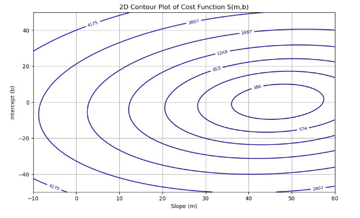
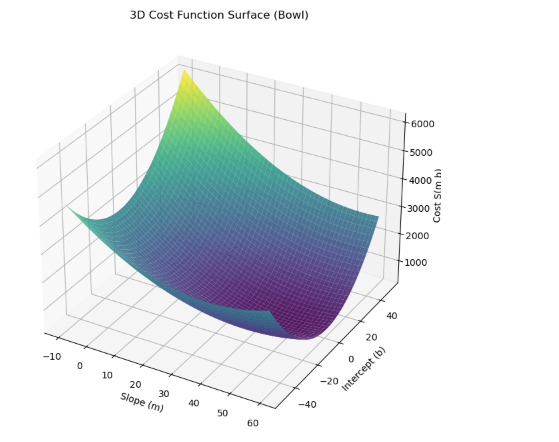
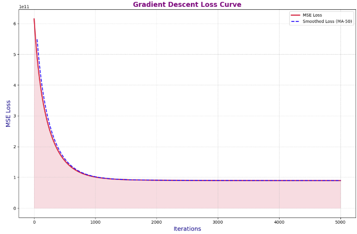
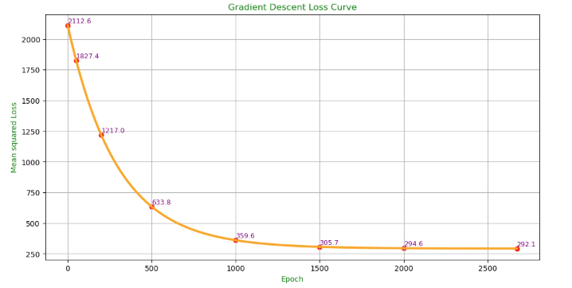
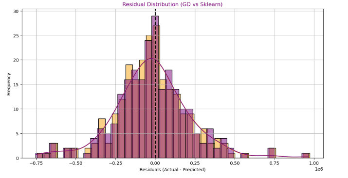

# 🌈 Batch Gradient Descent From Scratch

A complete, from-scratch implementation of **Batch Gradient Descent** for Linear Regression using Python and NumPy.  
This project includes **single-variate** and **multi-variate** models, performance comparison with scikit-learn, and multiple high-quality visualizations.

---

## 📊 Visual Results

Below are some of the key plots generated from the gradient descent implementation:

---

## 📘 Overview

Batch Gradient Descent updates the model parameters by evaluating the gradient of the cost function using **all samples** in the dataset for every iteration.  
This method is stable, deterministic, and widely used for linear regression problems.

---

## 🔧 Features Implemented

- Single-variate Batch Gradient Descent  
- Multi-variate Batch Gradient Descent  
- Loss curve visualization  
- Actual vs predicted comparison  
- Residual distribution analysis  
- 2D contour & 3D cost surface plots  
- Comparison with scikit-learn's LinearRegression  

---

## 🎯 Summary

This project demonstrates how Batch Gradient Descent works at a fundamental level, including:

- Cost surface interpretation  
- Parameter convergence behavior  
- Residual error behavior  
- Comparison of custom GD vs scikit-learn  

It serves as a strong foundational reference for understanding optimization in machine learning.

---

